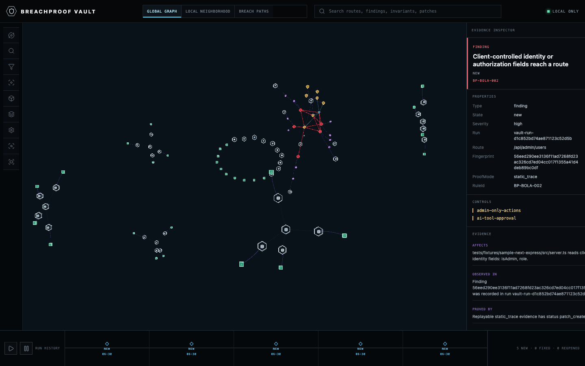

# BreachProof

**Build a local cyber range from your app. Prove reachable breach paths. Generate fixes. Verify they stay fixed.**

BreachProof is a local proof engine for repositories and environments you own or are explicitly authorized to test. It is not a scanner, not a CVE list, and not a generic AI wrapper. It maps your app, builds a fake-data local cyber range, tests security invariants, turns breach paths into replayable evidence, generates competing patch candidates, and produces audit-ready reports.

## What Makes BreachProof Different

Traditional scanners report possible issues. BreachProof is built around a stronger loop:

```text
map -> corpus -> reachability -> range -> invariants -> proof -> patch tournament -> verification -> final report
```

The goal is not to dump every CVE or every lint finding. The goal is to answer:

- Is the vulnerable component actually installed?
- Is it reachable from a route, job, webhook, upload, or AI tool flow?
- Is there a realistic breach path?
- Can BreachProof prove it safely with local fixtures or static trace evidence?
- Can it produce multiple focused fixes and regression test artifacts?
- Does the same validation pass after the fix is explicitly applied?

## Safety Model

BreachProof is defensive and local-first:

- owned or explicitly authorized systems only
- one-time scope approval
- no repeated permission prompts inside approved scope
- no public-target scanning
- no credential theft or data exfiltration
- no destructive exploitation
- no malware, stealth, or persistence
- no paid API activation or billing flows
- no source-code upload by default
- deterministic behavior without an LLM
- optional online corpus imports only when explicitly requested

By default, `breachproof run --auto` writes artifacts only. It does not edit the analyzed repository unless explicit apply mode is enabled.

## Install

From this repository:

```sh
npm install
npm run build
node dist/cli/index.js doctor
```

Future published usage:

```sh
npx breachproof run --auto
```

Docker:

```sh
docker build -t breachproof .
docker run --rm -v "$PWD:/workspace" breachproof run --auto --yes
```

## One-Time Approval Gate

Approve the local project scope once:

```sh
breachproof init --yes
```

This writes:

- `breachproof.scope.yml`
- `.breachproof/approval.json`
- `.breachproof/state.sqlite`
- `.breachproof/audit.log`

The approval stores timestamp, workspace, mode, allowed paths, staging targets, autofix settings, and a scope hash. After approval, BreachProof runs inside that scope without repeated prompts. Anything outside scope is refused or marked for manual review.

## CLI

```sh
breachproof run --auto
breachproof proof run
breachproof proof replay <findingId>
breachproof range init
breachproof range seed
breachproof invariants init
breachproof invariants test
breachproof graph view
breachproof map
breachproof corpus import advisories/osv.json advisories/epss.csv
breachproof reachability
breachproof validate --focus authz
breachproof fix --tournament
breachproof verify
breachproof report --format markdown
breachproof report --format sarif
breachproof report --format html
breachproof vibe audit
breachproof ai-lab run
breachproof vault build
breachproof vault view
breachproof vault timeline
breachproof skill export --codex
breachproof ci
breachproof doctor
```

Modes:

- `local`: local repo, local containers, local services, local test data
- `staging`: exact allowlisted staging URLs/domains only
- `ci`: audit and safe validation with SARIF output
- `audit`: passive analysis
- `validate`: safe non-destructive validation
- `fix`: patch and regression-test artifacts
- `auto`: full artifact loop

## Required Artifacts

`breachproof run --auto` writes:

- `reports/system-map.json`
- `reports/vulnerability-corpus-summary.json`
- `reports/reachability-graph.json`
- `reports/attack-graph.json`
- `reports/bola-map.json`
- `reports/ownership-traces.json`
- `reports/validation-plan.json`
- `reports/invariant-results.json`
- `reports/request-sequences.json`
- `reports/evidence.json`
- `reports/evidence-summary.json`
- `reports/patch-summary.json`
- `reports/patch-tournament.json`
- `reports/verification.json`
- `reports/range-summary.json`
- `reports/final-report.md`
- `reports/final-report.html`
- `reports/final-report.json`
- `reports/final-report.sarif`

Per-finding patch proposals live under:

```text
reports/patches/<findingId>/
```

Each patch folder contains `patch.diff`, proposed regression test content, tournament candidates (`candidate-a.patch`, `candidate-b.patch`, `candidate-c.patch`, `candidate-d.patch`), `scorecard.json`, and `recommended.patch`.

Replayable evidence lives under:

```text
reports/evidence/<findingId>/
```

Each evidence folder contains `setup.json`, `requests.har`, `request-sequence.json`, `expected.json`, `actual-before.json`, `actual-after.json`, `replay.sh`, `regression.test.ts`, and `README.md`.

Local cyber range artifacts live under:

```text
.breachproof/range/
```

The range uses fake tenants, fake users, fake invoices/projects/files, a fake PostgreSQL seed, and mock webhook/payment/email provider placeholders. It never imports production secrets or production records.

## Proof Mode

Proof Mode focuses on evidence, not alerts:

```sh
breachproof proof run --yes
breachproof proof replay <findingId>
breachproof report --format html
```

`proof run` generates replayable evidence for confirmed or simulated findings. If a full HTTP replay is not possible yet, the evidence still validates the artifact structure and prints exact local reproduction steps. BreachProof does not claim `verified_fixed` unless a real after-replay exists.

## One-Command Demo

The fixture in `tests/fixtures/sample-next-express` demonstrates:

- Cross-tenant invoice access: a user-controlled invoice id reaches `prisma.invoice.findUnique` without a tenant filter.
- Webhook trust abuse: an unsigned webhook is accepted.
- AI tool misuse: dangerous tools are reachable without allowlist or approval policy.

Run:

```sh
REPO="$PWD"
tmpdir="$(mktemp -d)"
cp -R tests/fixtures/sample-next-express/. "$tmpdir"
(cd "$tmpdir" && npx tsx "$REPO/src/cli/index.ts" run --auto --yes)
```

Open `reports/final-report.html`, then inspect `reports/evidence/<findingId>/README.md` and `reports/patches/<findingId>/scorecard.json`.

## BreachProof Vault Security Memory

Every autonomous run records an append-only local snapshot and builds an offline 3D security-memory report at `reports/vault/index.html`. The report connects routes, findings, invariants, patches, replay evidence, tests, and protected assets without fetching remote scripts or sending repository data away from the workspace.

The deterministic history fixture demonstrates the regression-memory story:

```text
Day 1: /api/invoices/[id] violates tenant-isolation -> new
Day 2: tenant predicate replay is blocked -> verified fixed
Day 5: invoice issue returns -> reopened
Day 5: /api/orders/[id] has the same control/sink pattern -> similar bug detected
```

Use `breachproof vault build` to rebuild from existing report artifacts, `breachproof vault view` to print the local report path, and `breachproof vault timeline` to inspect lifecycle events. `vault view` opens nothing unless `--open` is explicitly supplied.



## Security Invariants

Create the default invariant file:

```sh
breachproof invariants init
```

This writes `breachproof.invariants.yml` with:

- `tenant-isolation`
- `object-ownership`
- `admin-only-actions`
- `price-integrity`
- `webhook-signature-required`
- `file-upload-policy`
- `ai-tool-approval`

Evaluate it:

```sh
breachproof invariants test
```

## Vulnerability Intelligence

BreachProof normalizes local files shaped like:

- OSV records
- NVD/CVE API records
- GitHub advisory records
- CISA KEV JSON/CSV data
- FIRST EPSS CSV/API-style data
- BreachProof local rule packs

It merges aliases, CWE, severity/CVSS, KEV flags, EPSS scores, references, affected package ranges, and remediation guidance into a single local corpus model. It then prioritizes based on installed packages and reachability instead of blindly reporting every record.

## Reports

The final report is breach-path oriented:

- executive summary
- vulnerability corpus loaded
- relevant matches
- reachability analysis
- confirmed breach paths
- local proof evidence
- generated fixes
- regression tests
- verification results
- remaining risk
- manual review items
- attack graph

Example:

```md
Finding: Cross-tenant invoice access
Status: patch_created
Path: normal user -> invoice route -> missing tenant ownership check -> invoice data exposure
Proof: local validation created fake tenants and showed the unsafe path without production data
Fix: add tenant ownership check
Regression test: user A cannot access tenant B invoice
Verification: not run until the patch is explicitly applied
```

## Plugins and Skills

Plugins use manifest fields:

- `name`
- `version`
- `type`
- `supportedFrameworks`
- `inputs`
- `outputs`
- `permissionsNeeded`
- `entrypoint`

Supported plugin contribution types include analyzers, validators, invariant packs, range providers, vulnerability feeds, patch generators, report renderers, and AI-agent policy checks.

Export a Codex-compatible skill pack:

```sh
breachproof skill export --codex
```

## CI

CI mode is non-destructive:

```sh
breachproof ci
```

The included GitHub Actions workflow runs typecheck, lint, tests, build, doctor, and CI SARIF generation.
It also writes a Markdown step summary, uploads the HTML/Markdown/SARIF reports as an artifact, and can comment a short PR summary when the workflow token has permission.

## Limitations

BreachProof does not guarantee that an application is secure. Static analysis and deterministic simulation can miss issues or produce false positives. It does not run unsafe exploits, steal data, dump credentials, mutate production, or scan public targets. Manual review remains required for issues that cannot be safely validated.
